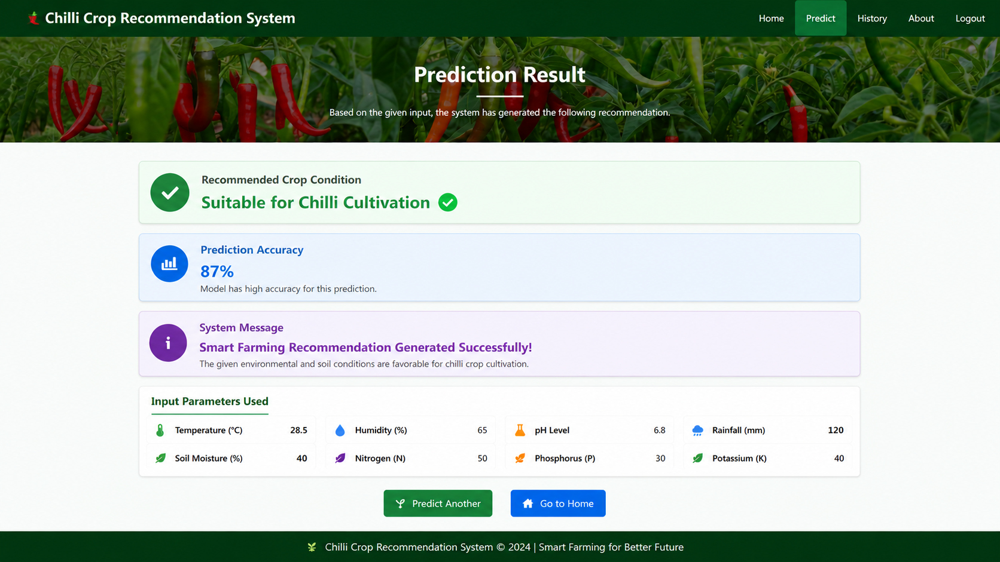

🌶 Chilli Crop Recommendation System using Machine Learning

📌 Project Overview

This project is a full-stack Machine Learning + Flask web application designed to recommend suitable conditions for chilli crop cultivation and classify chilli crop predictions using trained ML models.

The system helps improve agricultural decision-making by analyzing important farming parameters such as soil condition, temperature, rainfall, humidity, and crop characteristics.

It combines Machine Learning, Flask backend development, frontend integration, and database support to provide smart farming recommendations for better crop productivity.

---

✨ Key Features

- Chilli Crop Recommendation using Machine Learning
- Flask-based Full Stack Web Application
- Trained ML Models using ".pkl" files
- Frontend Integration using HTML, CSS, JavaScript
- Database Support using SQLite
- Agricultural Data Analysis
- Smart Farming Decision Support

---

🛠 Technologies Used

- Python
- Flask
- Pandas
- NumPy
- Scikit-learn
- Machine Learning
- HTML
- CSS
- JavaScript
- SQLite
- CSV Dataset Handling

---

📊 Example Output

Recommended Crop Condition: Suitable for Chilli Cultivation ✅

Prediction Accuracy: 87%

Smart Farming Recommendation Generated Successfully

---

📷 Sample Output

---

🚀 Project Structure

Intelligent-Chilli-Crop-Recommendation-System/
│
├── main.py
├── requirements.txt
├── test1.db
├── new1.csv
├── newred.csv
├── save.csv
│
├── models/
│   ├── chilli.pkl
│   ├── chilli2.pkl
│   ├── greenchilli.pkl
│   └── greenchilli2.pkl
│
├── templates/
│
├── static/
│
└── README.md

---

🚀 How to Run

1. Clone Repository

git clone https://github.com/devvvii18-ui/Intelligent-Chilli-Crop-Recommendation-System.git

2. Install Dependencies

pip install -r requirements.txt

3. Run Flask Application

python main.py

---

🔥 Future Improvements

- Real-Time Weather API Integration
- Mobile Application for Farmers
- Multi-Crop Recommendation System
- Dashboard Analytics for Agriculture
- Advanced Deep Learning Models

---

👨‍💻 Author

Devi Shankar

Aspiring Data Analyst | ML Enthusiast | NLP Projects.
